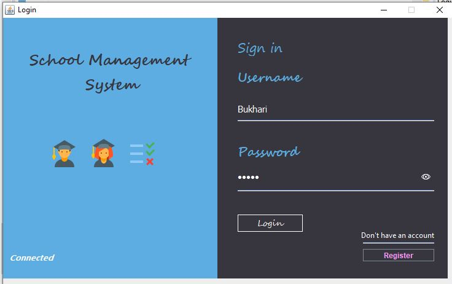

# School-Project
Desktop Application written in Java For Managing School Activities. The Application Manages the Admissions , Students , Fees , Classes , Class Teachers ,Attendance and All the necessary functions required to perform in the School.

